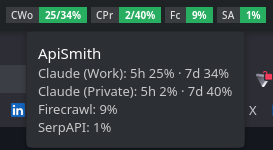

# ApiSmith

A KDE Plasma 6 widget that monitors usage across multiple API services. Track Claude session limits, Firecrawl credits, and SerpAPI quotas at a glance — with color-coded status pills, threshold notifications, and detailed breakdowns in an expandable popup.

<p align="center">
  
</p>

## Features

- **Claude account monitoring** — tracks both the 5-hour session window and 7-day rolling window for up to two independent Claude accounts (e.g. Work + Private), with plan type detection (Free/Pro/Max)
- **Firecrawl credit tracking** — monitors credits used vs plan allocation via the Firecrawl v2 API
- **SerpAPI quota tracking** — monitors monthly search usage and hourly search counts
- **Compact panel pills** — labeled, color-coded badges in your KDE panel showing per-service usage at a glance. Claude pills display dual `5h/7d%` format
- **Expanded popup dashboard** — tabbed interface with detailed service cards, progress bars, reset countdowns, and exhaustion estimates
- **Threshold notifications** — configurable warning and critical thresholds that trigger KDE Plasma notifications
- **Exhaustion estimation** — predicts when you'll hit your usage limit based on current consumption rate ("Used up in 2h 15m")
- **Launch buttons** — open Claude Code or Claude Desktop directly from the widget
- **Cookie-based auth** — extracts Claude session cookies from Chrome, Brave, Helium, Chromium, or Firefox. No API keys needed for Claude
- **Keyring integration** — API keys for Firecrawl and SerpAPI can be stored securely in the system keyring instead of plaintext config
- **Theme-adaptive** — uses Kirigami theme colors, works with Breeze Light, Breeze Dark, and custom themes
- **Fully configurable** — refresh intervals, thresholds, browser selection, billing reset days, backend port, and per-service enable/disable

## Requirements

- **KDE Plasma 6.0+**
- **Python 3.10+**
- **systemd** (for the backend service)
- A **supported browser** with an active Claude session: Chrome, Brave, Helium, Chromium, or Firefox
- **Kitty** terminal emulator (for the "Open Claude Code" launch button — hardcoded, modify `main.qml` if you use a different terminal)

## Installation

### 1. Clone and install

```bash
git clone https://github.com/peternaame-boop/plasma-apismith.git
cd apismith
chmod +x install.sh
./install.sh
```

The installer:
1. Creates a Python venv at `~/.local/share/api-dashboard/`
2. Installs `browser-cookie3` and `keyring` dependencies
3. Sets up a systemd user service (`api-dashboard`) that runs the backend daemon
4. Copies the widget to `~/.local/share/plasma/plasmoids/com.peterduffy.apiusage/`

### 2. Restart Plasma

```bash
systemctl --user restart plasma-plasmashell
```

### 3. Add the widget

Right-click your panel > Add Widgets > search for "ApiSmith" > drag to panel.

### 4. Configure API keys (optional)

For Firecrawl and SerpAPI, set keys via the widget settings (right-click > Configure > Services) or via the system keyring:

```bash
python3 -c "import keyring; keyring.set_password('api-dashboard', 'firecrawl', 'YOUR_KEY')"
python3 -c "import keyring; keyring.set_password('api-dashboard', 'serpapi', 'YOUR_KEY')"
```

Claude accounts need no API keys — they authenticate via browser cookies extracted from your logged-in browser session.

## Usage

### Panel view

The compact panel shows one pill per service:

```
┌────┬────────┐ ┌────┬────────┐ ┌────┬─────┐ ┌────┬─────┐
│CWo │ 25/34% │ │CPr │  2/40% │ │ Fc │  9% │ │ SA │  1% │
└────┴────────┘ └────┴────────┘ └────┴─────┘ └────┴─────┘
```

- **CWo** / **CPr** — Claude Work / Claude Private, showing `5-hour/7-day%`
- **Fc** / **SA** — Firecrawl / SerpAPI, showing single usage `%`
- Color coding: green (OK), orange (warning threshold), red (critical threshold)

Click any pill to open the expanded popup.

### Expanded popup

The popup has two tabs:

**Claude tab** — a card per account showing:
- 5-hour session usage with progress bar, reset countdown, and exhaustion estimate
- 7-day weekly usage with progress bar, reset countdown, and exhaustion estimate
- Quick-launch buttons (Open Claude Code, Resume, Open Claude Desktop)

**API Keys tab** — a card per service showing:
- Usage bar with `X / Y credits` or `X / Y searches`
- Billing cycle reset countdown

### Hover tooltip

Hovering the widget shows a summary:

```
ApiSmith
Claude (Work): 5h 25% · 7d 34%
Claude (Private): 5h 2% · 7d 40%
Firecrawl: 9%
SerpAPI: 1%
```

## Configuration

Right-click the widget > Configure to access settings.

### General

| Setting | Range | Default | Description |
|---------|-------|---------|-------------|
| Refresh interval | 1–60 min | 5 | How often to poll services |
| Backend port | 1024–65535 | 19853 | HTTP port for the backend daemon |
| Notifications | on/off | on | Enable KDE threshold notifications |
| Warning threshold | 50–95% | 75% | Percentage that triggers a warning notification |
| Critical threshold | 60–100% | 90% | Percentage that triggers a critical notification |

### Services

| Setting | Options | Default | Description |
|---------|---------|---------|-------------|
| Firecrawl enabled | on/off | on | Toggle Firecrawl monitoring |
| Firecrawl API key | text | (keyring) | API key, or leave empty to use system keyring |
| Firecrawl reset day | 1–31 | 16 | Billing cycle reset day of month |
| SerpAPI enabled | on/off | on | Toggle SerpAPI monitoring |
| SerpAPI key | text | (keyring) | API key, or leave empty to use system keyring |
| SerpAPI reset day | 1–31 | 19 | Billing cycle reset day of month |
| Claude Work enabled | on/off | on | Toggle Claude Work account |
| Claude Work browser | chrome/brave/helium/chromium/firefox | chrome | Browser to extract cookies from |
| Claude Work label | text | Work | Display name in the widget |
| Claude Private enabled | on/off | on | Toggle Claude Private account |
| Claude Private browser | chrome/brave/helium/chromium/firefox | brave | Browser to extract cookies from |
| Claude Private label | text | Private | Display name in the widget |

## Architecture

```
apismith/
├── install.sh                  # Automated installer
├── uninstall.sh                # Clean uninstaller
├── backend/
│   ├── api_dashboard_daemon.py # Python HTTP server + service adapters + poller
│   ├── api_dashboard.service   # Systemd unit file (reference template)
│   └── requirements.txt        # Python dependencies
└── package/
    ├── metadata.json           # KDE Plasma plugin metadata
    └── contents/
        ├── applet/
        │   └── CompactApplet.qml      # Plasma compact applet container
        ├── config/
        │   ├── main.xml               # Configuration schema (kcfg)
        │   └── config.qml             # Config page registration
        └── ui/
            ├── main.qml               # Root PlasmoidItem — data model, lifecycle
            ├── CompactRepresentation.qml  # Panel pills
            ├── FullRepresentation.qml     # Expanded popup
            ├── ServiceCard.qml            # Reusable service detail card
            ├── StatusColors.qml           # Theme-aware color mapping
            ├── configGeneral.qml          # General settings page
            └── configServices.qml         # Services settings page
```

### How it works

```
KDE Panel (CompactRepresentation.qml)
     │ click
     v
Popup (FullRepresentation.qml → ServiceCard.qml)
     │
     │  all data flows through main.qml
     v
main.qml (PlasmoidItem)
     │
     │  XHR over HTTP to 127.0.0.1:19853
     │  GET /usage · POST /config · POST /refresh
     v
api_dashboard_daemon.py (systemd user service)
     │
     │  external API calls
     ├──→ claude.ai/api/organizations + /usage  (browser cookies)
     ├──→ api.firecrawl.dev/v2/team/credit-usage (API key)
     └──→ serpapi.com/account.json               (API key)
```

The QML frontend and Python backend communicate over local HTTP (`127.0.0.1` only — not exposed to the network). The backend runs independently as a systemd user service, surviving Plasma restarts. All external API calls happen in the backend — the widget never contacts external services directly.

### Data storage

| Path | Purpose |
|------|---------|
| `~/.local/share/api-dashboard/history.json` | Usage history (28-day retention, auto-pruned) |
| `~/.config/api-dashboard/config.json` | Backend config (synced from widget, `0600` permissions) |
| `~/.local/share/api-dashboard/` | Backend installation directory + Python venv |
| `~/.local/share/plasma/plasmoids/com.peterduffy.apiusage/` | Widget installation |
| `~/.config/systemd/user/api-dashboard.service` | Systemd service file |

### Backend endpoints

| Method | Path | Purpose |
|--------|------|---------|
| `GET` | `/health` | Health check |
| `GET` | `/usage` | All service usage data |
| `GET` | `/usage/{id}` | Single service usage (60s cache) |
| `GET` | `/history/{id}?period=24h\|7d\|28d` | Historical usage data points |
| `GET` | `/velocity/{id}` | Usage rate and ETA to limit |
| `POST` | `/config` | Push configuration from widget |
| `POST` | `/refresh` | Trigger immediate re-poll |

## Troubleshooting

### Widget shows "Backend unreachable"

Check that the backend service is running:

```bash
systemctl --user status api-dashboard
```

If it's not running, start it:

```bash
systemctl --user start api-dashboard
```

Check logs for errors:

```bash
journalctl --user -u api-dashboard -n 50
```

For verbose logging, stop the service and run the daemon manually:

```bash
systemctl --user stop api-dashboard
~/.local/share/api-dashboard/venv/bin/python ~/.local/share/api-dashboard/api_dashboard_daemon.py --debug
```

### Claude shows an error

- Make sure you're logged in to [claude.ai](https://claude.ai) in the configured browser
- Check that the correct browser is selected in widget settings (Configure > Services)
- If using Brave for private browsing, ensure the Claude session is in a regular (non-private) window — `browser-cookie3` cannot read incognito cookies
- Try restarting the browser, then click the refresh button in the widget popup

### Firecrawl / SerpAPI key not working

- Verify the key by testing it directly: `curl -H "Authorization: Bearer YOUR_KEY" https://api.firecrawl.dev/v2/team/credit-usage`
- If using keyring, verify it's stored: `python3 -c "import keyring; print(keyring.get_password('api-dashboard', 'firecrawl'))"`
- Clear and re-set the key in either the widget config or keyring

### Notifications not appearing

- Ensure notifications are enabled in widget settings (Configure > General)
- Check that KDE notification settings aren't suppressing `plasma_workspace` notifications
- Verify thresholds are set lower than your current usage

### Widget not appearing after install

```bash
# Restart Plasma
systemctl --user restart plasma-plasmashell

# Verify the widget is installed
ls ~/.local/share/plasma/plasmoids/com.peterduffy.apiusage/
```

## Uninstall

```bash
./uninstall.sh
systemctl --user restart plasma-plasmashell
```

This stops the backend service, removes the systemd unit, deletes the backend files, and removes the widget.

## Security

- The backend binds to `127.0.0.1` only and is not accessible over the network
- Backend config file is written with `0600` permissions
- API keys can be stored in the system keyring instead of plaintext config
- Claude authentication uses session cookies extracted from your browser — no passwords or API keys are stored for Claude
- `browser-cookie3` reads cookie databases from your local browser profiles. It does not intercept network traffic or modify browser state

## License

GPL-3.0-or-later — see [LICENSE](LICENSE).

## Changelog

### v1.0.0 (2026-02-12)

- Initial release
- Claude account monitoring with dual 5-hour session and 7-day weekly usage tracking
- Support for two independent Claude accounts (Work + Private) with per-account browser selection
- Firecrawl credit usage monitoring via v2 API
- SerpAPI search quota monitoring
- Compact panel pills with label tabs and color-coded status (green/orange/red)
- Expanded popup with tabbed dashboard, progress bars, reset countdowns, and exhaustion estimates
- Quick-launch buttons for Claude Code and Claude Desktop
- Configurable warning and critical threshold notifications
- Cookie-based Claude authentication (Chrome, Brave, Helium, Chromium, Firefox)
- System keyring integration for API key storage
- Systemd user service backend with automatic polling
- Usage history with 28-day retention
- Theme-adaptive colors via Kirigami
- Accessibility support with screen reader labels
- Automated install and uninstall scripts
